# 🏢 Leave Management System

A full-stack Leave Management System built using **Spring Boot** and **React (Vite)** that automates employee leave application, approval workflows, and leave tracking within an organization.


---

# 🚀 Features

## 👨‍💼 Employee

* Apply for leave
* View leave balance
* View leave history
* Cancel leave requests (before approval)

## 👨‍💻 Manager

* View team leave requests
* Approve or reject leave requests
* Add remarks for approval/rejection

## 🧑‍💼 Admin (HR)

* Manage employees
* Configure leave types (Casual, Sick, etc.)
* Manage holidays
* View organization-wide reports

---

# 🔐 Authentication & Security

* JWT-based authentication
* Role-based access control (EMPLOYEE, MANAGER, ADMIN)
* Password encryption using BCrypt
* Secure REST APIs

---

# 🏗 Project Structure

```
leave-management-system/
├── frontend/   → React (Vite) client
├── backend/    → Spring Boot REST API
└── README.md
```

---

# 🛠 Tech Stack

## Backend

* Java 17
* Spring Boot
* Spring Security
* Spring Data JPA (Hibernate)
* MySQL

## Frontend

* React
* Vite
* Axios
* CSS

---

# 📊 Key Concepts Implemented

* RESTful API design
* DTO pattern (no direct entity exposure)
* Entity relationships (One-to-Many, Many-to-One)
* Pagination & filtering
* Global exception handling (`@ControllerAdvice`)
* Transaction management
* Role-based authorization

---

# ⚙️ Setup & Installation

## 📌 Prerequisites

Make sure you have installed:

* Java 17+
* Maven
* Node.js (v16+)
* MySQL

---

## 🔧 Backend Setup

```bash
cd backend
mvn clean install
mvn spring-boot:run
```

Backend runs at:

```
http://localhost:8080
```

---

## 🎨 Frontend Setup

```bash
cd frontend
npm install
npm run dev
```

Frontend runs at:

```
http://localhost:5173
```

---

# 🔗 API Integration

Frontend communicates with backend using:

```
http://localhost:8080/api/
```

Ensure backend is running before using frontend.

---
## 🔑 Demo Credentials

The application comes with preloaded demo users for testing different roles.
All users are automatically created on application startup via `data.sql`.

> **Password for all users:** `password123`

---

### 🧑‍💼 Admin

* **Email:** [admin@test.com](mailto:admin@test.com)
* **Access:** Full system access (manage employees, leave types, holidays, reports)

---

### 👨‍💻 Manager

* **Email:** [manager@test.com](mailto:manager@test.com)
* **Access:** Approve/reject leave requests, view team leave data

---

### 👨‍💼 Employee

* **Email:** [employee1@test.com](mailto:employee1@test.com)

* **Access:** Apply for leave, view balance and history

* **Email:** [employee2@test.com](mailto:employee2@test.com)

* **Access:** Apply for leave, view balance and history

---

## ⚠️ Notes

* These are **demo accounts for testing purposes only**
* Users are seeded automatically using `data.sql`
* Make sure the backend is running before attempting login
* JWT authentication is required for accessing protected endpoints

---

## ⚠️ Database Setup

Update the following property before running:

spring.datasource.password=your_mysql_password_here

Ensure MySQL is running and the database `leave_management_db` exists.

---

# 📄 API Documentation

```
(http://localhost:8080/swagger-ui/index.html)
```

---

# 📸 Screenshots

## 📸 Application Walkthrough

### 🔐 Authentication

Secure login using JWT-based authentication.

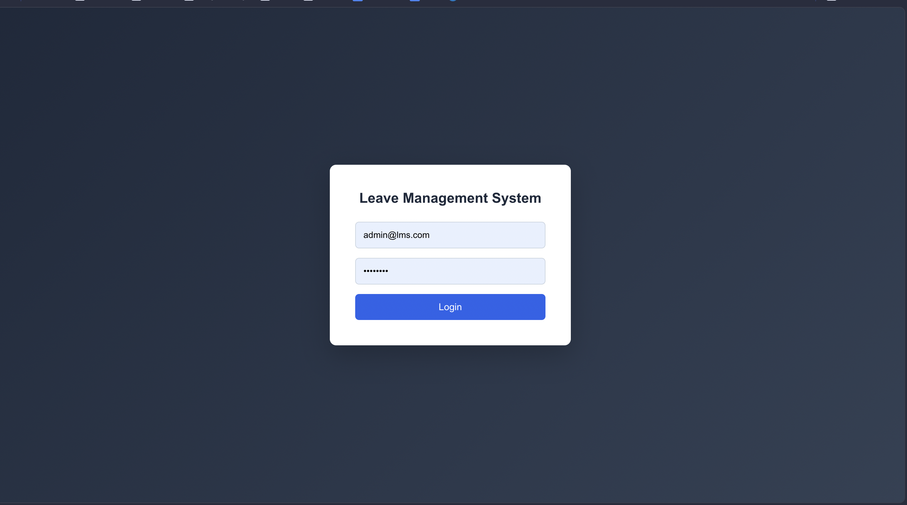

---

## 👨‍💼 Employee Features

### 📊 Employee Dashboard

Overview of leave balance and quick actions.

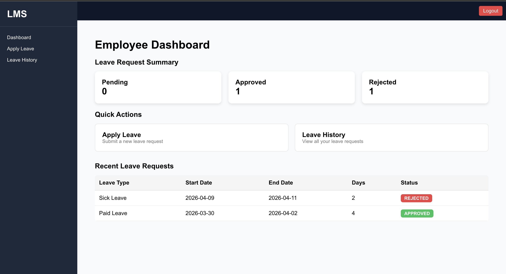

### 📝 Apply for Leave

Employees can submit leave requests.

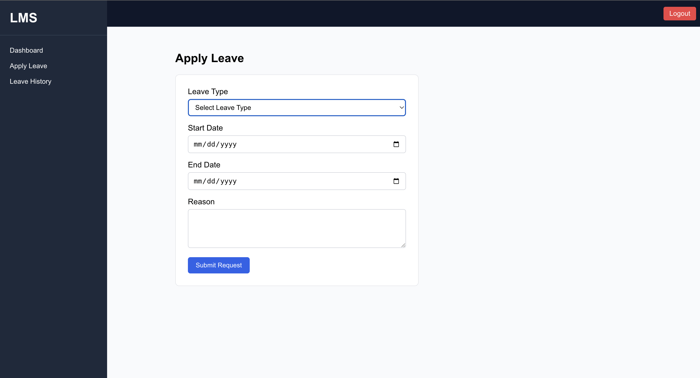

### 📜 Leave History

Track past and current leave requests.

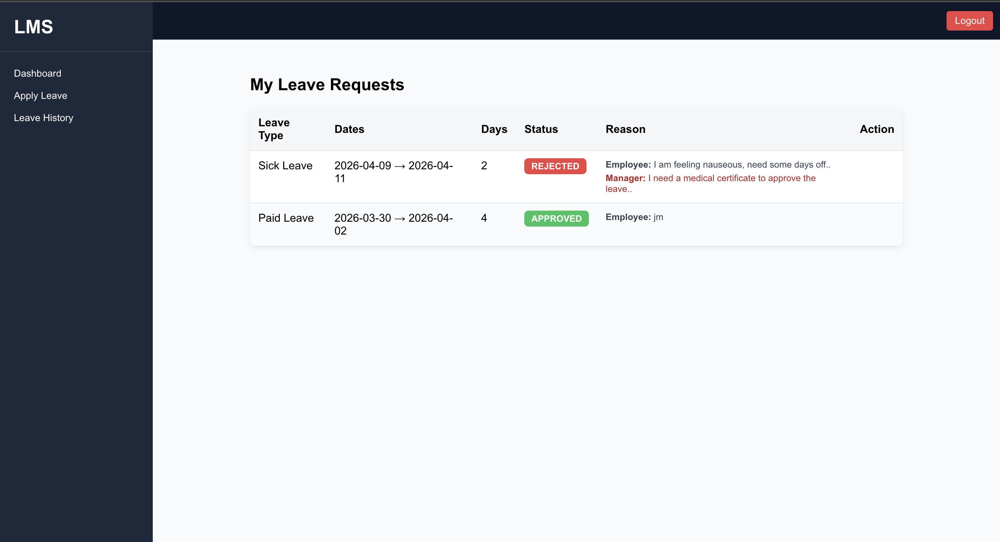

---

## 👨‍💻 Manager Features

### 📋 Manager Dashboard

View team leave activity and pending approvals.

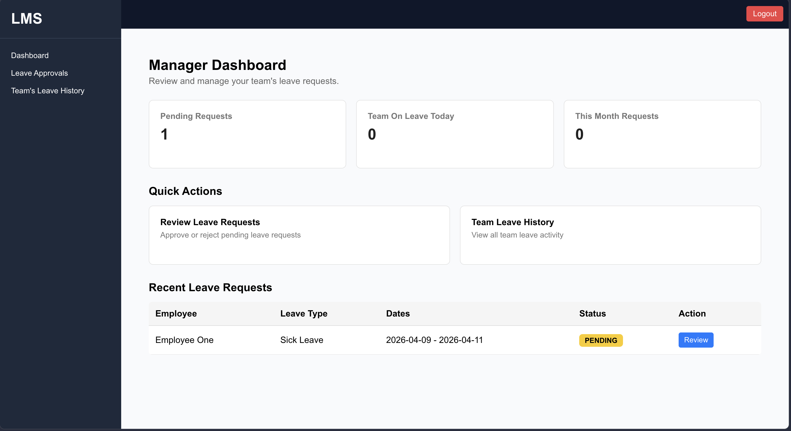

### ✅ Leave Approval System

Approve or reject employee leave requests.

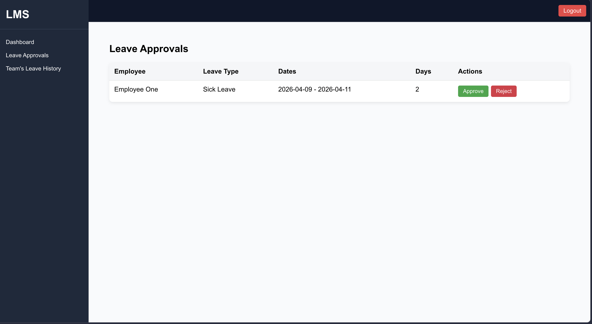

### 👥 Team Leave History

Monitor leave records across the team.

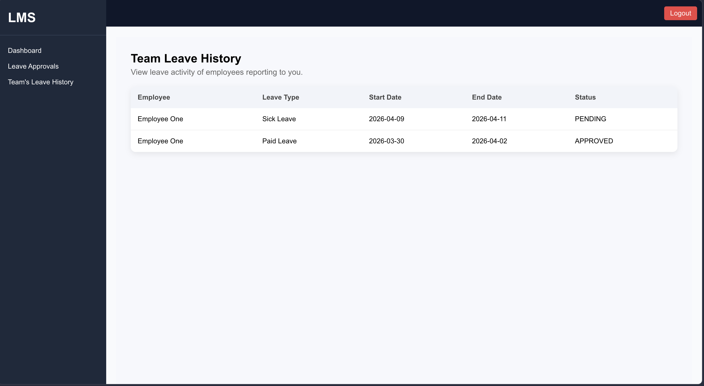

---

## 🧑‍💼 Admin Features

### 🛠 Admin Dashboard

Central control panel for system management.

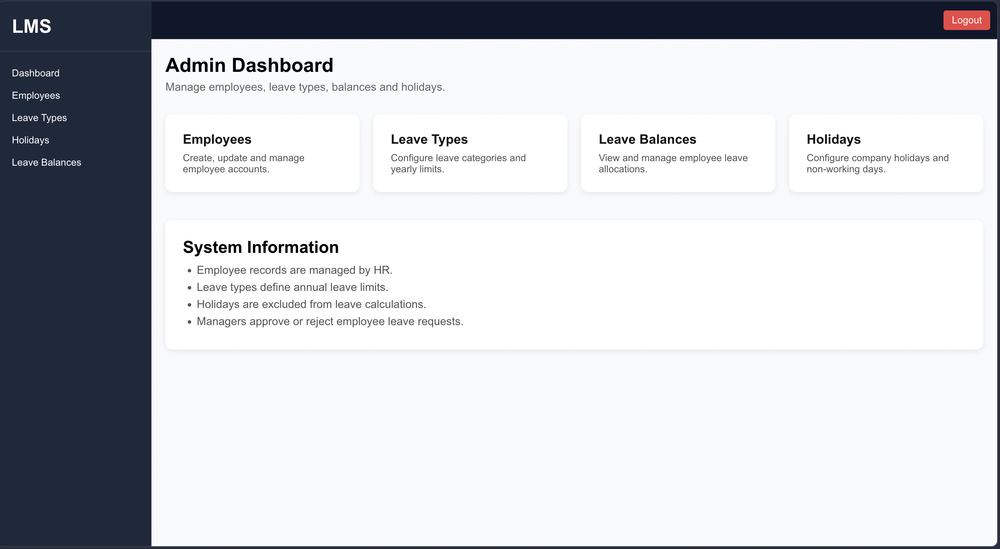

### 👨‍👩‍👧 Employee Management

Add, update, or manage employees.

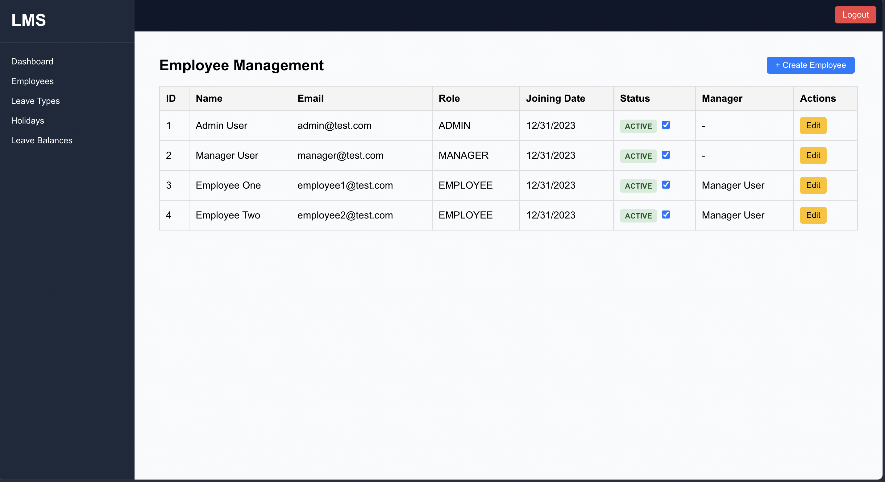

### 🏖 Leave Type Management

Configure different types of leaves.

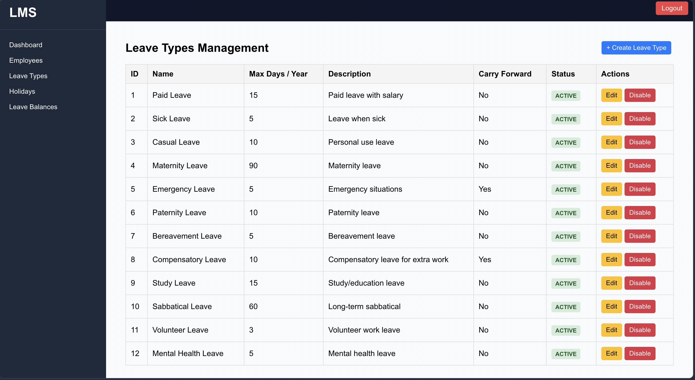

### 📊 Leave Balance Management

Manage and assign leave balances.

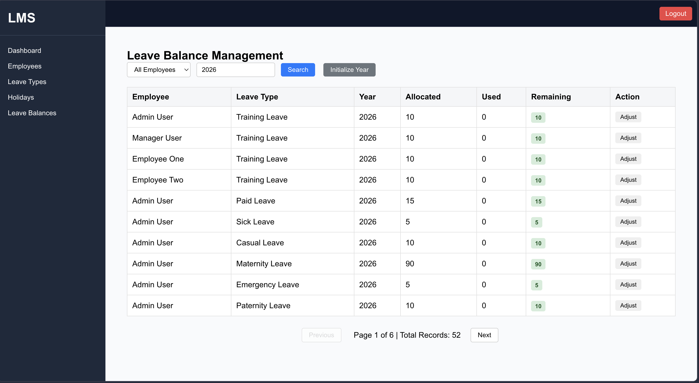

### 🎉 Holiday Management

Define and manage organizational holidays.

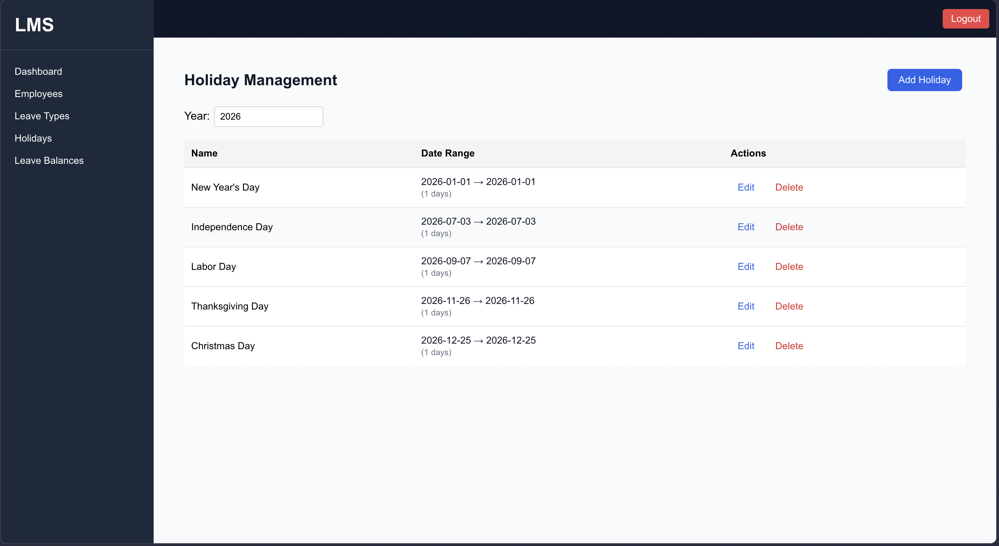

---
## 🎥 Demo Video

A quick walkthrough of the Leave Management System showcasing authentication, role-based access, and the complete leave workflow.

[](https://youtu.be/lZSX2dPrckc)

> Includes Admin, Manager, and Employee functionalities along with end-to-end leave request handling.
---

# ⚠️ Important Notes

* Ensure backend is running before frontend
* JWT token is required for protected endpoints
* Leave balance updates only after approval
* Holidays are excluded from leave calculation

---

# 💡 Future Improvements

* Email notifications for approvals/rejections
* File attachments for leave requests
* Dashboard analytics
* Docker deployment
* Role-based UI enhancements

---

# 🧠 What This Project Demonstrates

* Real-world enterprise backend design
* Authentication & authorization flows
* Business logic implementation (leave workflow)
* Full-stack integration
* Clean and scalable architecture

---

# 📌 Author

**Mithil Shah**

---

# ⭐ If you like this project

Give it a ⭐ on GitHub!
